# Easy_Survival
- 제작자 : boy0710boy,boyboy0710

# 기능

- 다이아몬드 곡괭이 조합법
- 인첸트병 조합법
- 겉날개 조합법
- 불사의 토템 조합법
- 바다의 심장 조합법
- 끈 조합법
- 이름표 조합법
- 안장 조합법
- 닭 스폰알 조합법
- 주민 스폰알 조합법
- 펜텀 스폰알 조합법
- 종 조합법
- 네더의 별 조합법

# 조합법

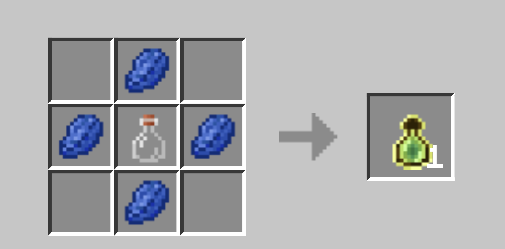
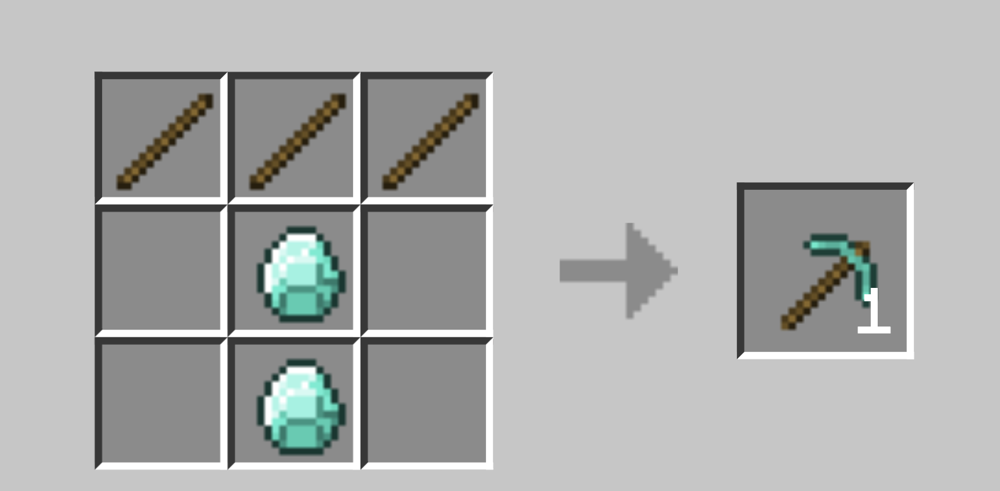
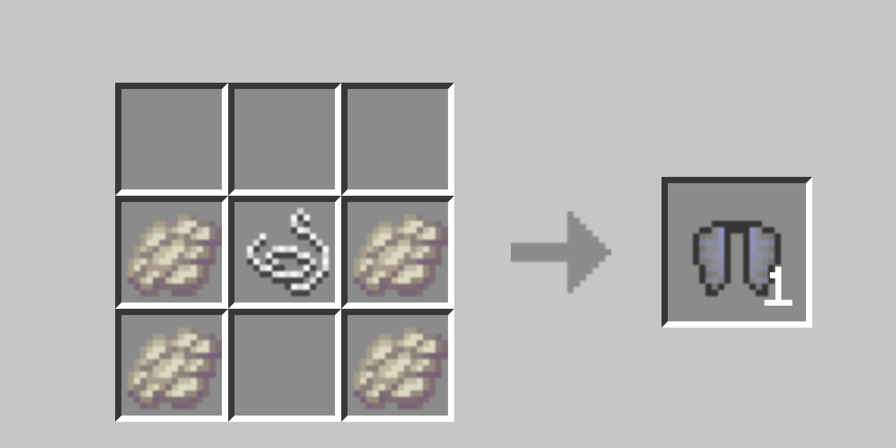
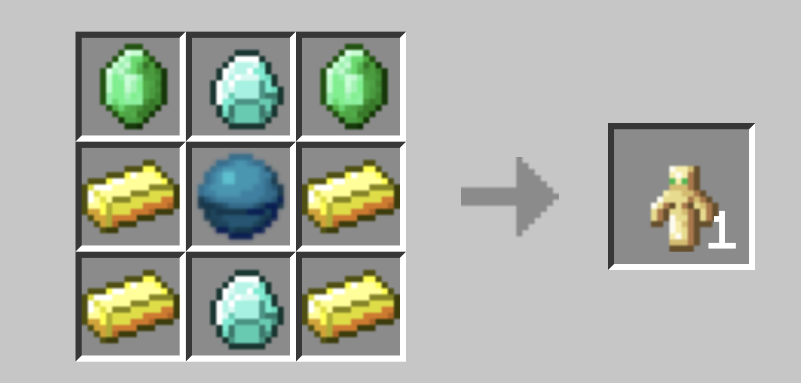
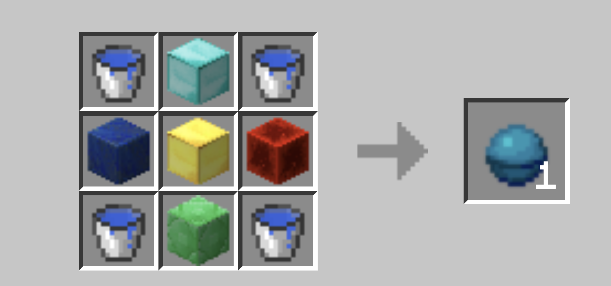
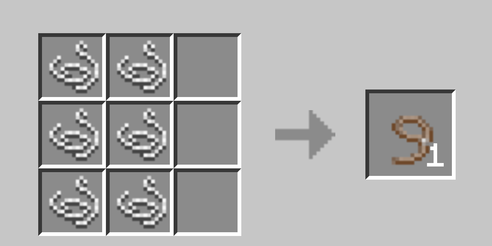

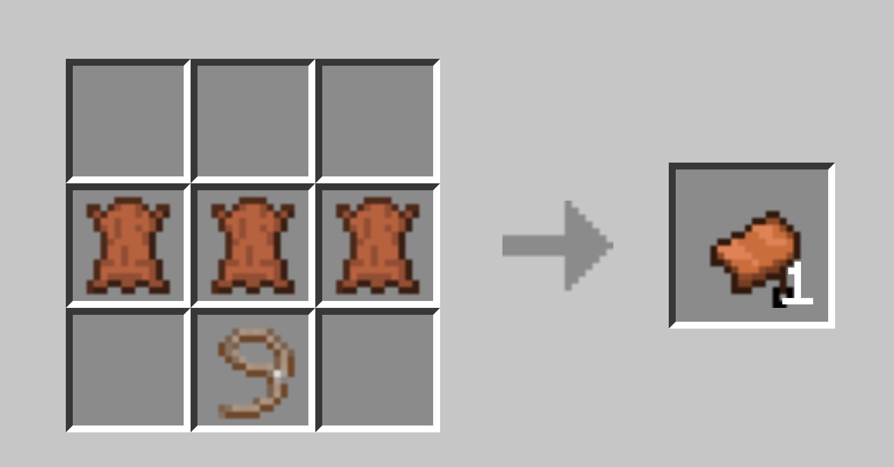
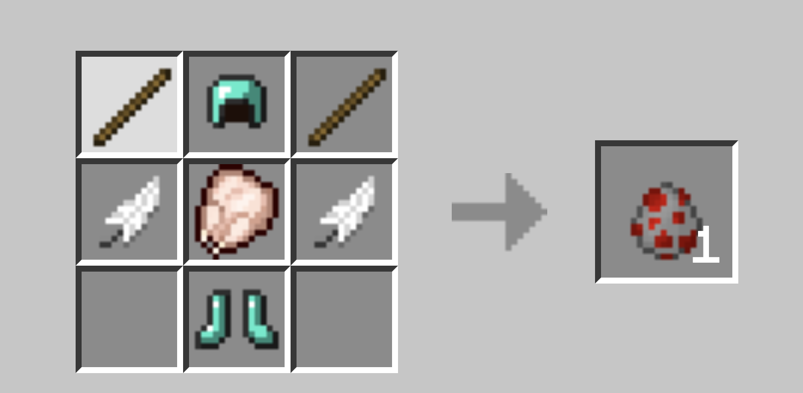
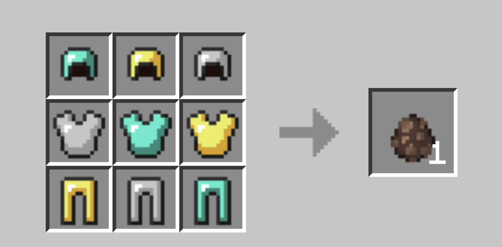 
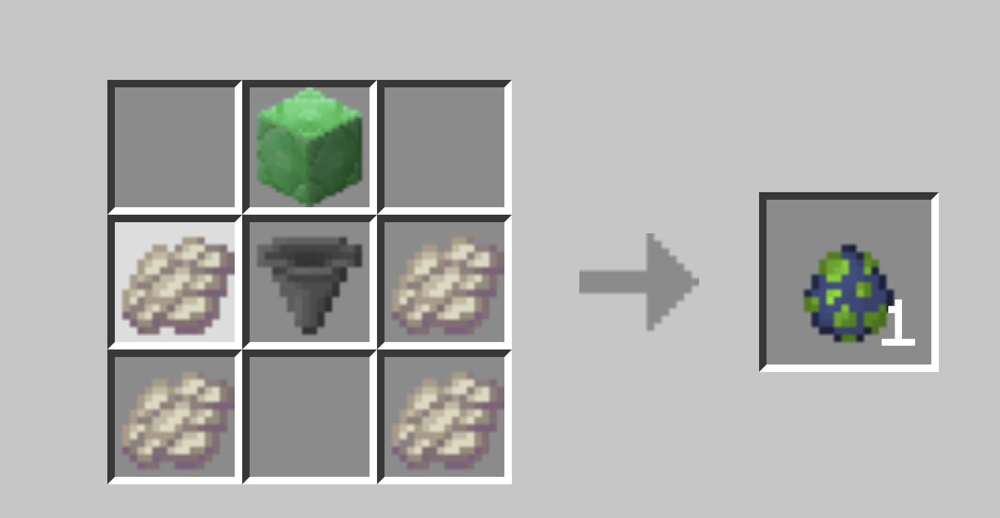
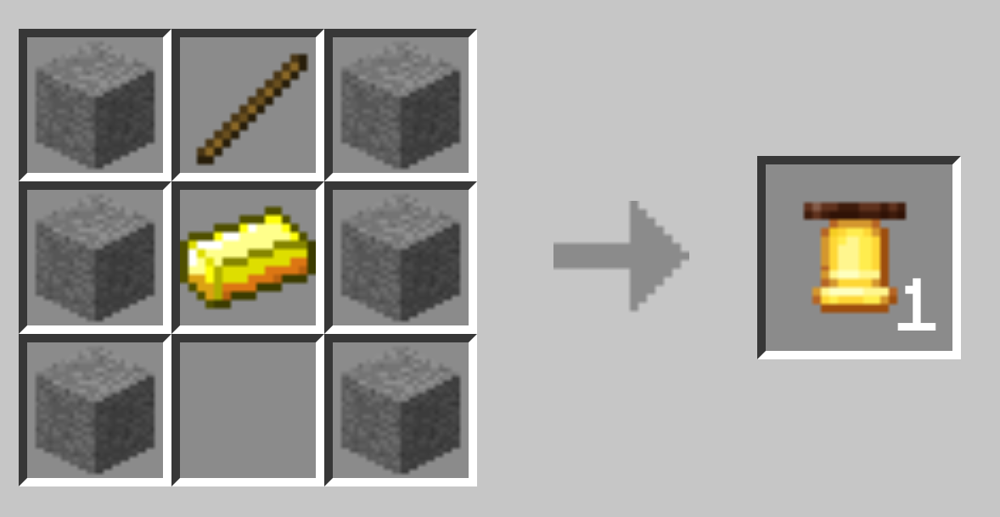
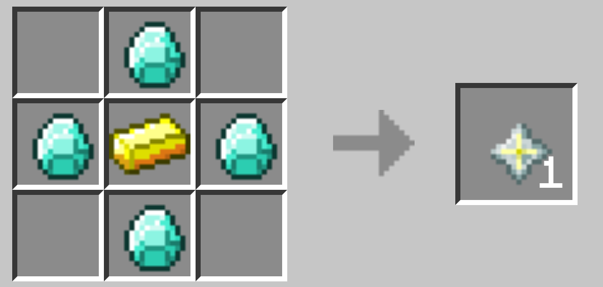
# 기타
- 이 플러그인은 제작자 boyboy0710과 boy0710boy가 공동으로 개발한 플러그인입니다
- 이지모드, 하드모드 추가예정
